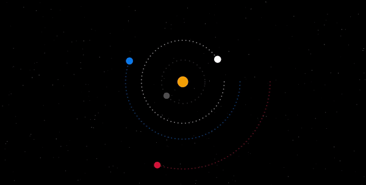

# Solar System Simulation in Rust

This project is my very first venture into Rust programming! It's a simulation of the solar system using the [Macrosquad framework](https://macroquad.rs/). It aims to visualize the celestial bodies in our solar system and demonstrate their orbits and movements in a graphical interface.

I used information from [NASA's Planetary Fact Sheet](https://nssdc.gsfc.nasa.gov/planetary/factsheet/) to gather data on various planets in our solar system. This data forms the basis for the parameters and characteristics of each celestial body simulated in the project.



## How to Run

```shell
cd solar_system
cargo run
```

## How to test
```shell
cd solar_system
cargo test
```